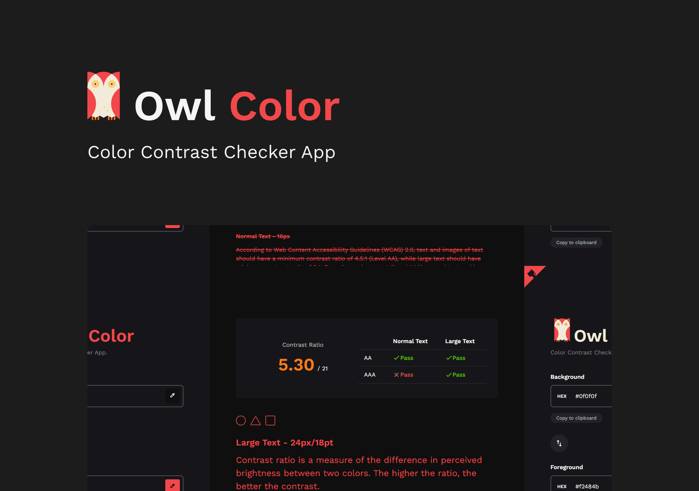

<p align="center">
  
</p>

<p align="center">
    
</p>

## 🧪 Technologies

This project was developed using the following technologies:

- [React](https://reactjs.org)
- [Next.js](https://nextjs.org/)
- [TypeScript](https://www.typescriptlang.org/)
- [SCSS](https://sass-lang.com/)

## 📚 Libs

Main libraries used in the application:

- [react-colorful](https://omgovich.github.io/react-colorful/)
- [react-github-corner](https://github.com/skratchdot/react-github-corner)
- [react-icons](https://react-icons.github.io/react-icons/)
- [tinycolor2](https://github.com/bgrins/TinyColor)

## 🔥 Preview

The easiest way to deploy your Next.js app is to use the [Vercel Platform](https://vercel.com/new?utm_medium=default-template&filter=next.js&utm_source=create-next-app&utm_campaign=create-next-app-readme) from the creators of Next.js.

[](https://https://owl-color.vercel.app/)

## 🚀 Getting started

Clone the project and access the folder.

```bash
$ git clone https://github.com/jneris-dev/owl-color.git
$ cd owl-color
```

Follow the steps below:
```bash
# Install the dependencies
$ yarn

# Start the project
$ yarn dev
```
The app will be available for access on your browser at http://localhost:3000

## 💻 Project

[Owl Color](https://owl-color.vercel.app/) it's a simple web tool built using react that allows you to check color contrast ratio between any two valid color. 🎨

## 📝 License

This project is licensed under the MIT License. See the [LICENSE](LICENSE) file for details.


---

<p align="center">Made with 🖤 by João Neris</p>
